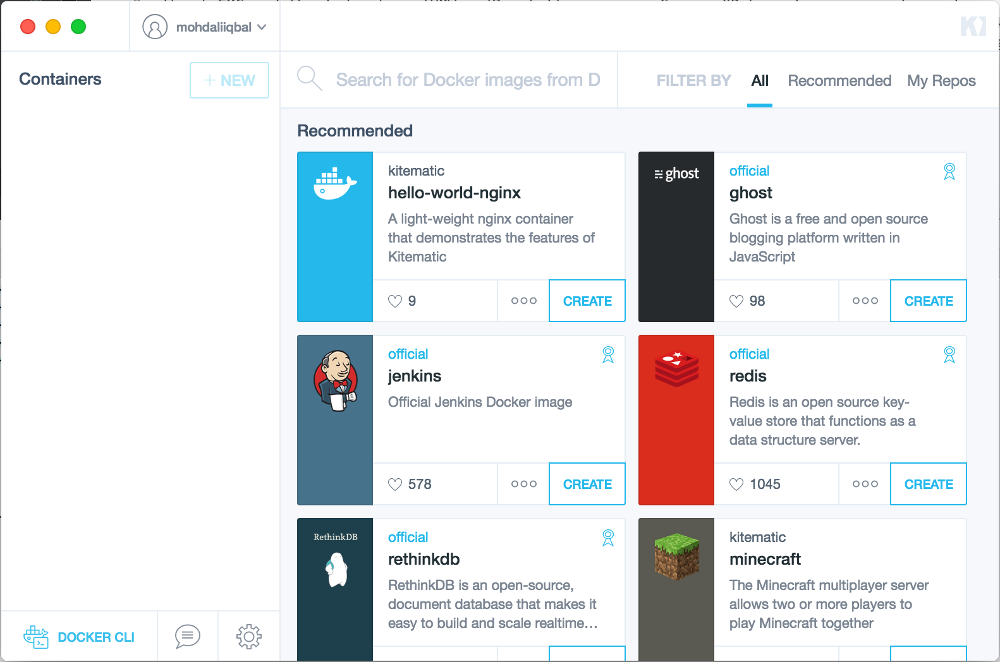
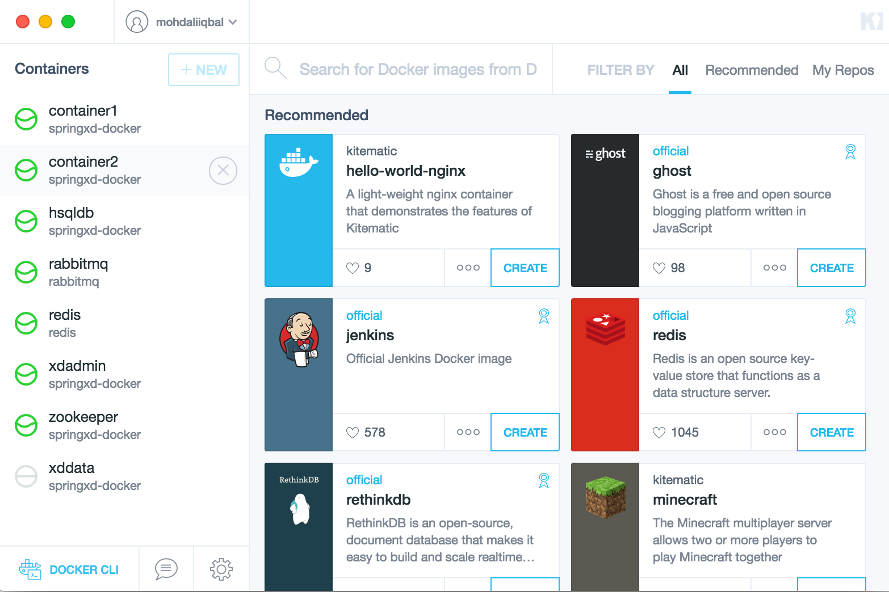
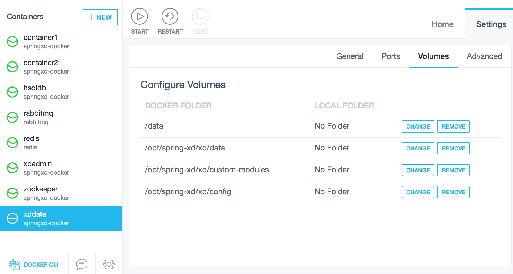

###Spring-XD Docker Composition
We at EMC and the federation (VMWare/Pivotal) are using Spring XD heavily on some of our large scale big data projects. It is very easy to setup Spring XD cluster up and running. However, to make it even more simpler to get up an running I was tasked to write a docker compose based spring xd development setup so that developers can just do a *"docker-compose up"* and they are good to go.

Following URL points to a github project which does exactly that.

https://github.com/mohdaliiqbal/springxd-docker-compose

to get up and running with Spring XD on your MacOS follow the steps given below

1. Download and install [Docker toolbox](https://www.docker.com/toolbox)

2. Open Kitematic from the toolbox installation.

3. Click DOCKER CLI Button at the bottom left

4. Change directory to a directory of your choice and run the following commands
    
      >  `cd /Development`
5. Clone the repository and issue following three commands to create XD cluster

      > `git clone https://github.com/mohdaliiqbal/springxd-docker-compose.git`
       
      >  `cd springxd-docker-compose`
       
      >  `docker-compose up`

**That's it!** 

*Note: You will need to wait until all the containers are downloaded to your docker-machine and are boot up.*

You will now see containers in your Kitematic window, note that one container ***xddata*** should be stopped and not running. That is our data container which is there to preserve the state of the cluster. Following how your kitematic screen should look like.

####How does it work
The project uses docker-compose yml file to configure various things in the cluster. Most importantly it uses a docker image that is created from my [dockerfile](https://github.com/mohdaliiqbal/springxd-docker/blob/master/Dockerfile) in a separte [github project](https://github.com/mohdaliiqbal/springxd-docker). The Dockerfile is an extension of official [Spring XD image](https://hub.docker.com/r/springxd) [dockerfile](https://hub.docker.com/r/springxd/base/~/dockerfile/) that is managed by [Eric Bottard](https://github.com/ericbottard/). *I may soon do a pull request to see if this new dockerfile can be pulled in official image*.

Following line is different from official image and is important in the dockerfile. It creates folders called `data` and `custom-modules` and under `/opt/spring-xd/xd` folder. We create these folders so that we can expose them as docker-volume from our data container. 

    RUN mkdir /opt/spring-xd-${XD_VERSION}/xd/data \
    && mkdir /opt/spring-xd-${XD_VERSION}/xd/custom-modules

####The Composition
Coming back to the [docker-compose.yml](https://github.com/mohdaliiqbal/springxd-docker-compose/blob/master/docker-compose.yml). The file defines the containers needed to run the Spring XD in distributed mode with Rabbit transport. All of the containers are configured to take `net:"host"` setting. That allows the containers to talk to each other using the loop back localhost address and make them look like running in one machine. This works very well with the out of the box `server.yml` default settings. 

#####XDDATA Container
Lets go through the container defined in the yml. Most importantly ***xddata*** container which is the first container defined in the `docker-compose.yml`.
<pre>
    <b>xddata:</b>
      <b>image:</b> mohdaliiqbal/springxd-docker
      <b>container_name:</b> xddata
      <b>volumes:</b>
      - /opt/spring-xd/xd/config
      - /opt/spring-xd/xd/custom-modules
      - /opt/spring-xd/xd/data
      - /data
      <b>net:</b> "host"
      <b>command:</b> "true"
      <b>user:</b> springxd
</pre>
The above snippet from yml tells docker-compose to create a docker container called xddata from mohdaliiqbal/springxd-docker repository. It exposes 4 volumes, one is the `config` folder, second the `custom-module` folder which will hold the shared custom-modules between all the containers, third the `data` folder which is used by hsqldb and zookeeper to keep their state, and fourth the `/data` which is used by redis container. The

*Disclaimer: RabbitMQ state is not persisted as of now, i will do that once i get some time*. 

#####Redis Container
Following snippet configures the redis container. The redis container exposes `/data` volume, we tell docker to give `redis` container volumes from `xddata` container which is exposing a `/data` volume, essentially everything that `redis` is going to write will start persisting in the `/data` folder of the `xddata` container. Same mechanism is used to persist state of the every other container in the composition.
<pre>
    <b>redis</b>:
      <b>image:</b> redis
      <b>container_name:</b> redis
      <b>net:</b> "host"
      <b>volumes_from:</b>
      - xddata
</pre>   

#####Zookeeper Container
Zookeeper container is created and asked to use volumes from `xddata` container. The zookeeper that comes out of the box with spring xd creates data directory in `../xd/data` from the current working directory. Therefore the working directory is modified to suit the start up script and data location. It is done so that it writes to `/opt/spring-xd/xd/data` which is mounted on volume from the `xddata` container. Following snippet configures `zookeeper` container. 
<pre>
<b>zookeeper:</b>
      <b>container_name:</b> zookeeper
      <b>image:</b> mohdaliiqbal/springxd-docker
      <b>working_dir:</b> /opt/spring-xd/zookeeper/bin
      <b>command:</b> ./zkServer.sh start-foreground
      <b>net:</b> "host"
      <b>volumes_from:</b>
      - xddata
</pre>

##### The HSQLDB Container
The HSQL Database that comes out of the box is used to hold the Spring XD batch database. The database stores its data in `/opt/spring-xd/xd/data` which is mounted on docker volume from `xddata`, so it survives container restarts. The container is also asked to use `springxd` user as the default user for running the process. Following is the `docker-compose.yml` snippet to create the `hsqldb` container.
<pre>
    <b>hsqldb:</b>
      <b>image:</b> mohdaliiqbal/springxd-docker
      <b>container_name:</b> "hsqldb"
      <b>command:</b> hsqldb/bin/hsqldb-server
      <b>net:</b> "host"
      <b>user:</b> springxd
</pre>

##### The XD Admin Container
The XD Admin container is the master container. It takes `/opt/spring-xd/xd/config` and `/opt/spring-xd/xd/custom-modules` from the `xddata` container. So when a new custom module is uploaded it gets stored in `/opt/spring-xd/xd/custom-modules` within the `xddata` container. This allows the sharing of `custom-modules` directory between `xd admin` and `xd container` nodes. The container is started with `springxd` user so that the permission on `xddata` exposed volumes should allow writing of data to the volume. An environment file is provided that holds important environment variable. These variables set the default transport as `rabbit` and connects with the `rabbit` docker container. This file can be used to change environment of spring xd admin and container nodes. For more on environment variables you can read [Spring XD guide](http://docs.spring.io/spring-xd/docs/current/reference/html). Following snippet is for the `xdadmin` docker container. Finally the port 9393 is forwarded to `9393` on the docker-machine so that you can point your `xd-shell` to `docker-machine` IP as your admin server. To obtain docker-machine IP you can use `docker-machine ip default` command (replace `default` with the name of your docker-machine name).

<pre>
<b>xdadmin:</b>
    <b>image:</b> mohdaliiqbal/springxd-docker
    <b>container_name:</b> xdadmin
    <b>user:</b> springxd
    <b>command:</b> xd/bin/xd-admin
    <b>env_file:</b> springxd.env
    <b>net:</b> "host"
    <b>volumes_from:</b>
    - xddata
    <b>ports:</b>
    - "9393:9393"
</pre>

<i>Variable in springxd.env file.</i>
<pre>XD_TRANSPORT=rabbit</pre>

#####Spring XD Containers x 2
The Spring XD containers are configured exactly the same way as the admin. They share the `config` and `custom-module` directories from `xddata` exposed volume, they are launched with `springxd` user, and they are told to take `rabbit` as the default transport layer. Following snippet is for the Spring XD container node 1.
<pre>
<b>xdcontainer1:</b>
  <b>image:</b> mohdaliiqbal/springxd-docker
  <b>container_name:</b> container1
  <b>command:</b> xd/bin/xd-container
  <b>user:</b> springxd
  <b>env_file:</b> springxd.env
  <b>volumes_from:</b>
   - xddata
  <b>net:</b> "host"
  <b>ports:</b>
  - "8080:8080"
  - "8081:8081"
</pre>

#####Rabbit MQ Containers
The Spring XD in this composition uses `rabbit` as its transport layer. Therefore a stock `rabbitmq` image is created and started to act as the transport. The default settings of the rabbitmq is used and it works pretty with the default setting so the Spring XD. Following snippet is for the rabbit container. The port is mapped to the docker-machine just in user wants to connect to RabbitMQ from any other client, it is something that is optional.
<pre>
<b>rabbitmq:</b>
  <b>container_name:</b> rabbitmq
  <b>image:</b> rabbitmq
  <b>net:</b> "host"
  <b>ports:</b>
  - "15672:15672"
</pre>

#####Useful Tips:
- This composition will also allow you to see the aggregated logs of all the nodes in the cluster in one screen if your run the compisition with `docker-compose up`. 

- You can also run the cluster in the background with `docker-compose up -d` command.
- If you need to ssh into any of the cluster node, you can use Kitematics and click the `EXEC` button on the top toolbar.
- Keep an eye on the images that are sitting in your `docker-machine` it could take some space and cleaning it regularly is a good idea.
- To recreate of the cluster you could use the following steps

> `docker-compose stop`

> `docker-compose rm`

> `docker-machine up` 

- To make changes to the configuration there are several things you can do

> You can modify springxd.env to make changes to the configuration that can be done using environment variables.

> You probably would notice that xddata is a stopped container and it never runs, so how do you modify the data inside it. The volumes inside the xddata container is mapped on to the xdadmin, xdcontainer nodes. You can SSH into any of the mounted containers using the above described way and modify the contents of the files.

> Finally if you want use your MacOS folder as spring xd config folder, then you can use Kitematics Volume tab under settings and change the config folder mount point to your folder. Following image describes the same technique

You are welcome to create issues and PR on the project to make it more useful for other non-trivial use cases.